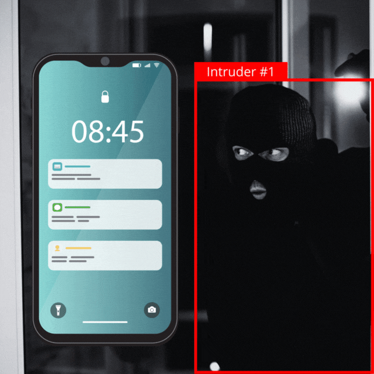

# Intruder Detection System

This project is an automated surveillance system that detects intruders in camera view and sends notifications to an administrator via email. It leverages a pre-trained YOLOv8 model for object detection and is capable of tracking intruders' movements. When a new intruder is detected, an email notification with images of the intruder is sent to the designated admin email address.

Reference: [beethogedeon/intrusalerts](https://github.com/beethogedeon/intrusalerts)


## Project Structure

```
├── detector.py        # Intruder detection and handling script
├── images              # Directory for storing images of detected intruders
├── main.py             # Main executable script to run the intruder detection
├── notifications.py    # Module for handling email notifications
├── requirements.txt    # List of project dependencies
└── weights
    └── yolov8n.pt      # Pre-trained model weights for YOLOv8
```

## Setup

1. Clone the repository to your local machine.

```sh
    git clone https://github.com/ausarhuy/intruders-detection.git
```

2. Install the required dependencies:

    ```sh
    pip install -r requirements.txt
    ```

3. Before configuring email notifications, you need an app password for your email account. Visit [Google App Passwords](https://myaccount.google.com/apppasswords), create a new app password, and copy the provided password.

4. Set up your environment variables for email notifications by creating a `.env` file in the project root with the following content:

    ```env
    INTRUSALERTS_PASSWORD=your_app_password
    INTRUSALERTS_FROM_EMAIL=your_email@gmail.com
    INTRUSALERTS_TO_EMAIL=admin_email@example.com
    ```

    Replace `your_app_password` with the password generated in step 3 and the other placeholders with your actual email account and the admin's email address.

## Usage

Run the intruder detection script with the command:

```sh
python main.py --capture_index <camera_index>
```

Replace `<camera_index>` with the index or the IP address of the camera you wish to use for video capture.

## How It Works

- `main.py` sets up the camera input and email notification system before starting the detection process.
- `detector.py` houses the `PersonDetection` class, which captures video frames, identifies intruders, saves their images, and triggers an email notification for any new intruder detection.
- `notifications.py` takes care of sending out emails. When invoked, it sends an email with the attached images of the detected intruder.

## Requirements

For the email notifications to work, you must use an email account that permits SMTP access. The script is configured for Gmail's SMTP server, but you can adjust the SMTP settings to work with another email provider if necessary.

Additionally, you will need a camera compatible with the system and an environment that can run the PyTorch library.

## License

This project is open-sourced under the [MIT License](LICENSE).

## Contributing

Feel free to contribute to this project. Suggested improvements, bug reports, or pull requests are always welcome.

## Support

For any questions, issues, or assistance with this project, please open an issue in the repository.